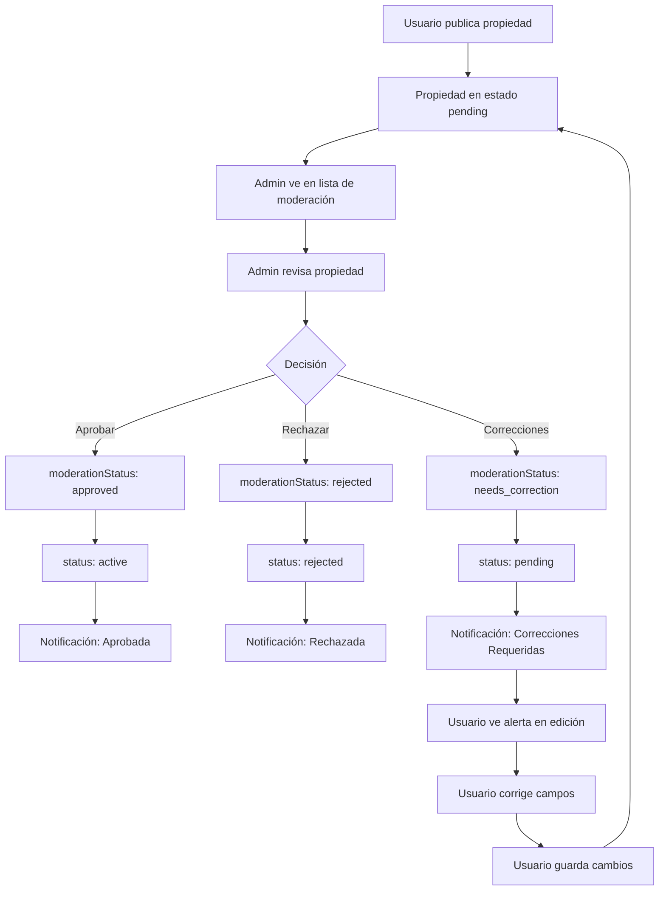

# Sistema de Moderación de Propiedades - LIVINNING

## Descripción General

Sistema completo de moderación de propiedades que permite a los administradores revisar, aprobar, rechazar o solicitar correcciones en las propiedades publicadas por usuarios. Incluye notificaciones automáticas y visualización de violaciones en la página de edición.

## Arquitectura

### Principios SOLID Aplicados

1. **Single Responsibility Principle (SRP)**
   - Cada endpoint tiene una única responsabilidad
   - `moderate/route.ts` - Solo modera propiedades
   - `pending-moderation/route.ts` - Solo lista propiedades pendientes

2. **Open/Closed Principle (OCP)**
   - Sistema extensible para nuevos tipos de violaciones
   - Fácil agregar nuevos campos a moderar

3. **Dependency Inversion Principle (DIP)**
   - Uso de interfaces TypeScript
   - Componentes reutilizables

## Estructura de Archivos

```
app/api/admin/properties/
├── [id]/moderate/route.ts                    # POST - Moderar propiedad
└── pending-moderation/route.ts               # GET - Lista propiedades pendientes

app/dashboard/[role]/
└── propiedades-moderacion/page.tsx           # Página de moderación (Admin)

app/dashboard/[role]/propiedades/[id]/editar/
└── page.tsx                                  # Página de edición (actualizada con alertas)

components/properties/
├── property-moderation-dialog.tsx            # Diálogo de moderación
└── field-violation-alert.tsx                 # Componente de alerta de violación

types/
└── database.ts                               # Tipos actualizados (PropertyDocument, etc.)

lib/utils/
└── constants.ts                              # PROPERTY_MODERATIONS collection
```

## Tipos de Datos

### PropertyDocument (actualizado)

```typescript
export interface PropertyDocument {
  // ... campos existentes

  // Moderación
  moderationStatus?: 'pending' | 'approved' | 'rejected' | 'needs_correction';
  moderatedBy?: string; // Clerk ID del admin
  moderatedAt?: Date;
  fieldViolations?: PropertyFieldViolation[];
  moderationNotes?: string;
}
```

### PropertyFieldViolation

```typescript
export interface PropertyFieldViolation {
  field: string; // Nombre del campo (title, price, images, etc.)
  message: string; // Comentario del admin
  severity: 'low' | 'medium' | 'high';
}
```

### PropertyModerationDocument

```typescript
export interface PropertyModerationDocument {
  _id: ObjectId;
  propertyId: ObjectId;
  propertyTitle: string;
  ownerId: string;
  ownerName: string;

  // Resultado
  action: 'approve' | 'reject' | 'request_corrections';
  fieldViolations?: PropertyFieldViolation[];
  generalNotes?: string;

  // Admin
  moderatedBy: string;
  moderatedByName: string;
  moderatedAt: Date;

  // Notificación
  notificationSent: boolean;
  notificationId?: ObjectId;

  createdAt: Date;
}
```

## API Endpoints

### 1. POST `/api/admin/properties/[id]/moderate`

Modera una propiedad específica.

**Permisos:** SUPERADMIN, ADMIN, HELPDESK

**Body:**
```json
{
  "action": "request_corrections",
  "fieldViolations": [
    {
      "field": "title",
      "message": "El título contiene información engañosa",
      "severity": "high"
    },
    {
      "field": "price",
      "message": "El precio parece incorrecto para esta ubicación",
      "severity": "medium"
    }
  ],
  "generalNotes": "Por favor corrige estos campos antes de volver a publicar"
}
```

**Acciones disponibles:**
- `approve` - Aprobar propiedad (se publica automáticamente)
- `reject` - Rechazar propiedad (se marca como rechazada)
- `request_corrections` - Solicitar correcciones (se marca como pending con violaciones)

**Response:**
```json
{
  "success": true,
  "data": {
    "message": "Propiedad moderada exitosamente",
    "action": "request_corrections",
    "notificationSent": true
  }
}
```

**Efectos:**
1. Actualiza el campo `moderationStatus` de la propiedad
2. Guarda las violaciones en `fieldViolations`
3. Crea un registro en `property_moderations`
4. Envía notificación al dueño de la propiedad
5. Actualiza `status` de la propiedad:
   - `approve` → status: `active`
   - `reject` → status: `rejected`
   - `request_corrections` → status: `pending`

### 2. GET `/api/admin/properties/pending-moderation`

Obtiene propiedades pendientes de moderación.

**Permisos:** SUPERADMIN, ADMIN, HELPDESK

**Query Parameters:**
- `page` (number) - Página actual (default: 1)
- `limit` (number) - Resultados por página (default: 20)
- `status` (string) - Filtro de estado: `all`, `pending`, `needs_correction`

**Response:**
```json
{
  "success": true,
  "data": {
    "properties": [...],
    "total": 50,
    "page": 1,
    "limit": 20,
    "hasMore": true
  }
}
```

## Flujo Completo de Moderación



## Página de Moderación (Admin)

**Ruta:** `/dashboard/[role]/propiedades-moderacion`

**Acceso:** Solo SUPERADMIN, ADMIN, HELPDESK

### Características

1. **Lista de propiedades pendientes**
   - Tabla con imagen, título, propietario, precio, ubicación
   - Badge de estado (Pendiente / Necesita Corrección)
   - Paginación

2. **Filtros**
   - Todas
   - Solo Pendientes
   - Necesitan Corrección

3. **Acción de revisión**
   - Botón "Revisar" abre diálogo de moderación

## Diálogo de Moderación

**Componente:** `PropertyModerationDialog`

### Secciones

1. **Información de la propiedad**
   - Título, precio, ubicación, tipo

2. **Acción de moderación**
   - Botones: Aprobar, Solicitar Correcciones, Rechazar

3. **Violaciones por campo** (solo para correcciones/rechazo)
   - Botón "Agregar Violación"
   - Cada violación incluye:
     - Campo (select de PROPERTY_FIELDS)
     - Severidad (low, medium, high)
     - Mensaje (textarea)
   - Botón eliminar violación

4. **Notas generales**
   - Textarea para comentarios adicionales

### Campos disponibles para marcar violaciones

```typescript
const PROPERTY_FIELDS = [
  { value: 'title', label: 'Título' },
  { value: 'description', label: 'Descripción' },
  { value: 'price', label: 'Precio' },
  { value: 'address', label: 'Dirección' },
  { value: 'city', label: 'Ciudad' },
  { value: 'state', label: 'Estado' },
  { value: 'zipCode', label: 'Código Postal' },
  { value: 'images', label: 'Imágenes' },
  { value: 'propertyType', label: 'Tipo de Propiedad' },
  { value: 'transactionType', label: 'Tipo de Transacción' },
  { value: 'locationType', label: 'Tipo de Ubicación' },
  { value: 'bedrooms', label: 'Recámaras' },
  { value: 'bathrooms', label: 'Baños' },
  { value: 'area', label: 'Área' },
  { value: 'parkingSpaces', label: 'Espacios de Estacionamiento' },
  { value: 'other', label: 'Otro' },
];
```

## Página de Edición con Violaciones

**Ruta:** `/dashboard/user/propiedades/[id]/editar`

### Alertas de violación

**Si `moderationStatus === 'needs_correction'`:**

1. **Alerta general** (parte superior)
   - Ícono de advertencia
   - Mensaje: "Correcciones Requeridas por Moderación"
   - Muestra las notas del administrador
   - Lista de badges con campos que tienen problemas

2. **Alertas por campo**
   - Componente `<FieldViolationAlert />` debajo de cada campo
   - Muestra mensaje específico del admin
   - Color según severidad:
     - Baja (low) → Azul
     - Media (medium) → Amarillo
     - Alta (high) → Rojo

### Ejemplo de uso

```tsx
<div className="space-y-2">
  <Label htmlFor="title">Título de la propiedad *</Label>
  <Input
    id="title"
    value={formData.title}
    onChange={(e) => setFormData({ ...formData, title: e.target.value })}
  />
  <FieldViolationAlert violations={fieldViolations} fieldName="title" />
</div>
```

## Notificaciones

Cuando se modera una propiedad, se envía automáticamente una notificación al usuario:

### Aprobar

```
Título: ✅ Propiedad Aprobada
Mensaje: Tu propiedad "..." ha sido aprobada y ahora está publicada.
Tipo: info
Severidad: low
```

### Rechazar

```
Título: ❌ Propiedad Rechazada
Mensaje: Tu propiedad "..." ha sido rechazada.

Motivo: [generalNotes]
Tipo: violation
Severidad: high
```

### Solicitar Correcciones

```
Título: ⚠️ Correcciones Requeridas
Mensaje: Tu propiedad "..." necesita correcciones antes de ser publicada.

Campos con problemas:
• Título: El título contiene información engañosa
• Precio: El precio parece incorrecto

Notas adicionales: [generalNotes]

Tipo: warning
Severidad: medium/high (según cantidad de violaciones)
```

## Casos de Uso

### Caso 1: Aprobar propiedad

1. Admin entra a `/dashboard/admin/propiedades-moderacion`
2. Ve lista de propiedades pendientes
3. Click en "Revisar" en una propiedad
4. Revisa información
5. Click en "Aprobar"
6. Click en "Confirmar Moderación"
7. Sistema:
   - Actualiza propiedad a `moderationStatus: approved`, `status: active`
   - Crea registro en `property_moderations`
   - Envía notificación al usuario
8. Usuario ve notificación de aprobación
9. Propiedad ahora visible públicamente

### Caso 2: Solicitar correcciones

1. Admin entra a moderación
2. Click en "Revisar"
3. Click en "Solicitar Correcciones"
4. Click en "Agregar Violación"
5. Selecciona campo: "Título"
6. Selecciona severidad: "Alta"
7. Escribe mensaje: "El título contiene información engañosa"
8. Agrega más violaciones según necesario
9. Escribe notas generales
10. Click en "Confirmar Moderación"
11. Sistema:
    - Actualiza propiedad a `moderationStatus: needs_correction`
    - Guarda violaciones en `fieldViolations`
    - Envía notificación al usuario
12. Usuario recibe notificación en campanita
13. Usuario va a editar propiedad
14. Ve alerta general arriba
15. Ve alertas específicas en cada campo marcado
16. Corrige los problemas
17. Guarda cambios
18. Propiedad vuelve a estado `pending` para nueva revisión

### Caso 3: Rechazar propiedad

1. Admin revisa propiedad
2. Determina que viola términos completamente
3. Click en "Rechazar"
4. Escribe razón general
5. Opcionalmente marca violaciones
6. Click en "Confirmar Moderación"
7. Sistema:
   - Actualiza a `moderationStatus: rejected`, `status: rejected`
   - Envía notificación de rechazo
8. Propiedad no visible públicamente
9. Usuario ve notificación y razón de rechazo

## Seguridad

- ✅ Solo SUPERADMIN, ADMIN y HELPDESK pueden moderar
- ✅ Validación de permisos en cada endpoint
- ✅ Validación de ObjectId
- ✅ No se puede aprobar con violaciones
- ✅ Auditoría: se registra quién moderó y cuándo
- ✅ Notificaciones automáticas al usuario

## Mejoras Futuras

1. **Historial de moderaciones**
   - Ver todas las moderaciones de una propiedad
   - Timeline de cambios

2. **Estadísticas de moderación**
   - Propiedades moderadas por admin
   - Tiempo promedio de moderación
   - Tasa de aprobación/rechazo

3. **Templates de violaciones**
   - Plantillas predefinidas para problemas comunes
   - Autocompletar mensajes frecuentes

4. **Moderación por lotes**
   - Aprobar/rechazar múltiples propiedades a la vez

5. **Sistema de appeals**
   - Usuario puede apelar un rechazo
   - Admin puede revisar apelación

6. **Notificaciones en tiempo real**
   - WebSockets para notificar inmediatamente

7. **Reportes de usuarios**
   - Usuarios pueden reportar propiedades sospechosas
   - Se agregan a cola de moderación

## Contacto y Soporte

Para reportar bugs o sugerir mejoras en el sistema de moderación:
- GitHub Issues
- Email: support@livinning.com
