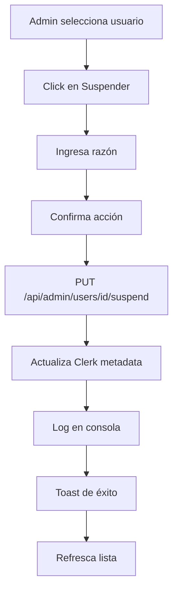
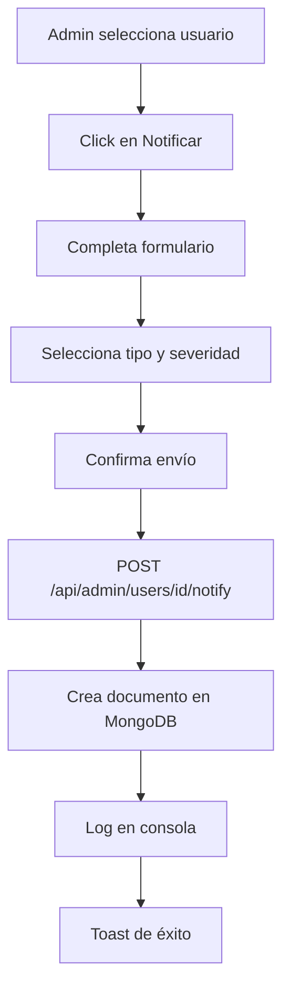

# Sistema de Gestión de Usuarios - LIVINNING

## Descripción General

Sistema completo de gestión de usuarios diseñado para roles administrativos (SUPERADMIN, ADMIN, HELPDESK). Permite suspender cuentas, activar usuarios suspendidos y enviar notificaciones de violación o advertencia.

## Arquitectura

### Principios SOLID Aplicados

1. **Single Responsibility Principle (SRP)**
   - Cada endpoint API tiene una única responsabilidad
   - `suspend/route.ts` - Solo suspende usuarios
   - `activate/route.ts` - Solo activa usuarios
   - `notify/route.ts` - Solo envía notificaciones

2. **Open/Closed Principle (OCP)**
   - Sistema extensible para agregar nuevos tipos de notificaciones
   - Validaciones centralizadas y reutilizables

3. **Dependency Inversion Principle (DIP)**
   - Uso de interfaces TypeScript (`ApiResponse`, `UserNotificationDocument`)
   - Abstracción de la capa de datos (MongoDB collections)

## Estructura de Archivos

```
app/
├── api/admin/users/
│   ├── route.ts                      # GET - Lista de usuarios
│   └── [id]/
│       ├── suspend/route.ts          # PUT - Suspender usuario
│       ├── activate/route.ts         # PUT - Activar usuario
│       └── notify/route.ts           # POST - Enviar notificación
└── dashboard/[role]/usuarios/
    └── page.tsx                      # Página de gestión de usuarios

types/
└── database.ts                       # UserDocument, UserNotificationDocument

lib/utils/
└── constants.ts                      # COLLECTIONS.USER_NOTIFICATIONS
```

## API Endpoints

### 1. GET `/api/admin/users`

Lista todos los usuarios del sistema con filtros opcionales.

**Permisos:** SUPERADMIN, ADMIN, HELPDESK

**Query Parameters:**
- `page` (number) - Página actual (default: 1)
- `limit` (number) - Usuarios por página (default: 20)
- `search` (string) - Búsqueda por nombre/email
- `role` (string) - Filtrar por rol

**Response:**
```json
{
  "success": true,
  "data": {
    "users": [
      {
        "id": "user_xxx",
        "email": "usuario@ejemplo.com",
        "name": "Juan Pérez",
        "role": "USER",
        "avatar": "https://...",
        "createdAt": 1234567890,
        "lastSignInAt": 1234567890,
        "isSuspended": false,
        "suspensionReason": null,
        "propertyCount": 5
      }
    ],
    "total": 100,
    "page": 1,
    "limit": 20
  }
}
```

### 2. PUT `/api/admin/users/[id]/suspend`

Suspende una cuenta de usuario.

**Permisos:** SUPERADMIN, ADMIN

**Body:**
```json
{
  "reason": "Violación de términos de servicio"
}
```

**Validaciones:**
- No se puede suspender a un SUPERADMIN
- La razón es obligatoria

**Response:**
```json
{
  "success": true,
  "data": {
    "message": "Usuario suspendido exitosamente"
  }
}
```

**Metadata actualizada en Clerk:**
```typescript
{
  isSuspended: true,
  suspendedAt: "2025-10-02T...",
  suspendedBy: "user_admin_id",
  suspensionReason: "Violación de términos de servicio"
}
```

### 3. PUT `/api/admin/users/[id]/activate`

Activa una cuenta previamente suspendida.

**Permisos:** SUPERADMIN, ADMIN

**Body:** No requiere

**Response:**
```json
{
  "success": true,
  "data": {
    "message": "Usuario activado exitosamente"
  }
}
```

**Metadata actualizada en Clerk:**
```typescript
{
  isSuspended: false,
  suspendedAt: null,
  suspendedBy: null,
  suspensionReason: null
}
```

### 4. POST `/api/admin/users/[id]/notify`

Envía una notificación al usuario (almacenada en MongoDB).

**Permisos:** SUPERADMIN, ADMIN, HELPDESK

**Body:**
```json
{
  "type": "violation",
  "title": "Violación de Política",
  "message": "Se detectó contenido inapropiado en tu publicación...",
  "severity": "high"
}
```

**Validaciones:**
- `type`: "warning" | "violation" | "suspension" | "info"
- `severity`: "low" | "medium" | "high" | "critical"
- Todos los campos son obligatorios

**Response:**
```json
{
  "success": true,
  "data": {
    "message": "Notificación enviada exitosamente"
  }
}
```

**Documento creado en MongoDB:**
```typescript
{
  _id: ObjectId("..."),
  userId: "user_xxx",
  type: "violation",
  title: "Violación de Política",
  message: "Se detectó contenido inapropiado...",
  severity: "high",
  isRead: false,
  createdBy: "user_admin_id",
  createdByName: "Admin Juan",
  createdAt: new Date(),
  readAt: undefined
}
```

## Página de Gestión de Usuarios

### Ruta
`/dashboard/superadmin/usuarios`
`/dashboard/admin/usuarios`
`/dashboard/helpdesk/usuarios`

### Características

1. **Tabla de Usuarios**
   - Lista paginada con 20 usuarios por página
   - Búsqueda en tiempo real
   - Filtro por rol
   - Indicadores visuales de estado (suspendido/activo)

2. **Acciones por Rol**

   **SUPERADMIN:**
   - ✅ Ver todos los usuarios
   - ✅ Suspender cualquier usuario (excepto SUPERADMIN)
   - ✅ Activar usuarios suspendidos
   - ✅ Enviar notificaciones

   **ADMIN:**
   - ✅ Ver todos los usuarios
   - ✅ Suspender usuarios (excepto SUPERADMIN)
   - ✅ Activar usuarios suspendidos
   - ✅ Enviar notificaciones

   **HELPDESK:**
   - ✅ Ver todos los usuarios
   - ❌ No puede suspender
   - ❌ No puede activar
   - ✅ Enviar notificaciones

3. **Diálogos Interactivos**

   **Suspender Usuario:**
   - Campo obligatorio para razón de suspensión
   - Confirmación antes de ejecutar
   - Feedback visual con toast

   **Activar Usuario:**
   - Confirmación simple
   - Muestra razón de suspensión previa
   - Feedback visual con toast

   **Enviar Notificación:**
   - Selector de tipo (warning, violation, suspension, info)
   - Selector de severidad (low, medium, high, critical)
   - Campos de título y mensaje
   - Validación en frontend y backend

## Sistema de Notificaciones

### Colección MongoDB: `user_notifications`

```typescript
interface UserNotificationDocument {
  _id: ObjectId;
  userId: string;              // Clerk user ID
  type: 'warning' | 'violation' | 'suspension' | 'info';
  title: string;
  message: string;
  severity: 'low' | 'medium' | 'high' | 'critical';
  isRead: boolean;
  createdBy: string;           // Clerk ID del admin
  createdByName: string;       // Nombre del admin
  createdAt: Date;
  readAt?: Date;
}
```

### Tipos de Notificaciones

1. **Warning (Advertencia)**
   - Para alertas menores
   - Notificar comportamientos sospechosos
   - Color: Amarillo

2. **Violation (Violación)**
   - Para infracciones de políticas
   - Contenido inapropiado
   - Color: Naranja

3. **Suspension (Suspensión)**
   - Notificar suspensión de cuenta
   - Razones de bloqueo
   - Color: Rojo

4. **Info (Información)**
   - Comunicados generales
   - Actualizaciones de políticas
   - Color: Azul

### Niveles de Severidad

- **Low (Baja)** - Información general
- **Medium (Media)** - Requiere atención
- **High (Alta)** - Acción inmediata recomendada
- **Critical (Crítica)** - Acción inmediata requerida

## Seguridad y Permisos

### Matriz de Permisos

| Acción | SUPERADMIN | ADMIN | HELPDESK | USER |
|--------|-----------|-------|----------|------|
| Ver usuarios | ✅ | ✅ | ✅ | ❌ |
| Suspender usuarios | ✅ | ✅ | ❌ | ❌ |
| Activar usuarios | ✅ | ✅ | ❌ | ❌ |
| Enviar notificaciones | ✅ | ✅ | ✅ | ❌ |
| Suspender SUPERADMIN | ❌ | ❌ | ❌ | ❌ |

### Validaciones de Seguridad

1. **Autenticación:**
   - Verificación de sesión con Clerk
   - Token JWT en cada request

2. **Autorización:**
   - Verificación de rol en publicMetadata
   - Permisos específicos por endpoint

3. **Protecciones:**
   - No se puede suspender a SUPERADMIN
   - Validación de campos requeridos
   - Sanitización de inputs

## Flujo de Trabajo

### Suspender Usuario



### Enviar Notificación



## Logging y Auditoría

Cada acción genera logs en consola:

```typescript
// Suspensión
console.log(`✅ User ${id} suspended by ${userId}`);

// Activación
console.log(`✅ User ${id} activated by ${userId}`);

// Notificación
console.log(`✅ Notification sent to user ${id} by ${userId}`);
```

### Información de auditoría almacenada:

**En Clerk (Suspensión):**
- `suspendedBy`: ID del administrador
- `suspendedAt`: Timestamp de la acción
- `suspensionReason`: Motivo ingresado

**En MongoDB (Notificaciones):**
- `createdBy`: ID del administrador
- `createdByName`: Nombre del administrador
- `createdAt`: Timestamp de creación

## Manejo de Errores

### Códigos de Error

- `401 UNAUTHORIZED` - No autenticado
- `403 FORBIDDEN` - Sin permisos o acción no permitida
- `400 VALIDATION_ERROR` - Datos inválidos
- `500 INTERNAL_ERROR` - Error del servidor

### Ejemplo de Response de Error

```json
{
  "success": false,
  "error": {
    "code": "FORBIDDEN",
    "message": "No tienes permisos para suspender usuarios"
  }
}
```

## Testing

### Casos de Prueba Recomendados

1. **Permisos:**
   - ✅ SUPERADMIN puede suspender usuarios
   - ✅ ADMIN puede suspender usuarios
   - ❌ HELPDESK no puede suspender usuarios
   - ❌ Nadie puede suspender a SUPERADMIN

2. **Validaciones:**
   - ❌ Suspender sin razón debe fallar
   - ❌ Notificación con tipo inválido debe fallar
   - ❌ Notificación sin severity debe fallar

3. **Flujo Completo:**
   - ✅ Suspender → Verificar metadata → Activar → Verificar limpieza
   - ✅ Enviar notificación → Verificar en MongoDB

## Mejoras Futuras

1. **Sistema de Notificaciones en Tiempo Real**
   - WebSockets o Server-Sent Events
   - Notificaciones push en dashboard del usuario

2. **Historial de Acciones**
   - Tabla de auditoría en MongoDB
   - Ver quién suspendió/activó a cada usuario

3. **Notificaciones por Email**
   - Integración con servicio de email (SendGrid, Resend)
   - Templates personalizados por tipo

4. **Suspensiones Temporales**
   - Agregar campo `suspendedUntil: Date`
   - Cronjob para reactivar automáticamente

5. **Panel de Estadísticas**
   - Usuarios suspendidos en el mes
   - Notificaciones enviadas por tipo
   - Gráficas de actividad administrativa

## Contacto y Soporte

Para reportar bugs o sugerir mejoras:
- GitHub Issues
- Email: support@livinning.com
